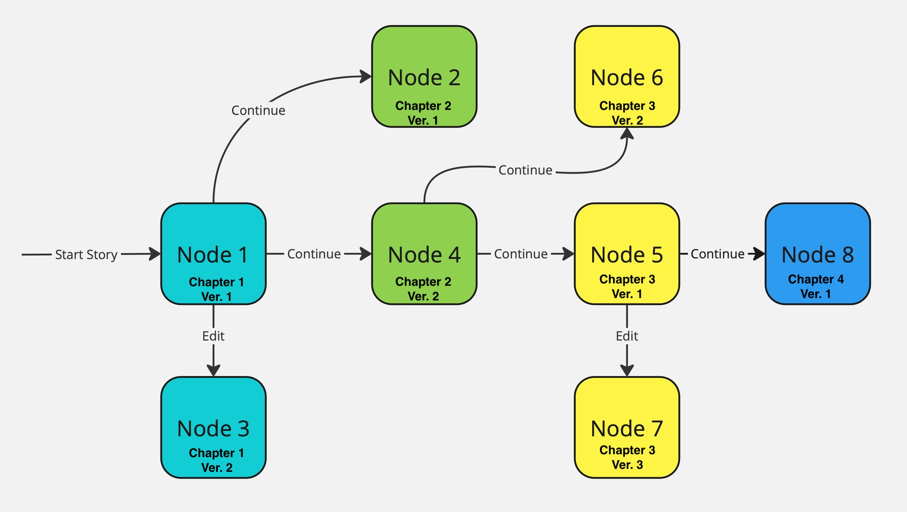
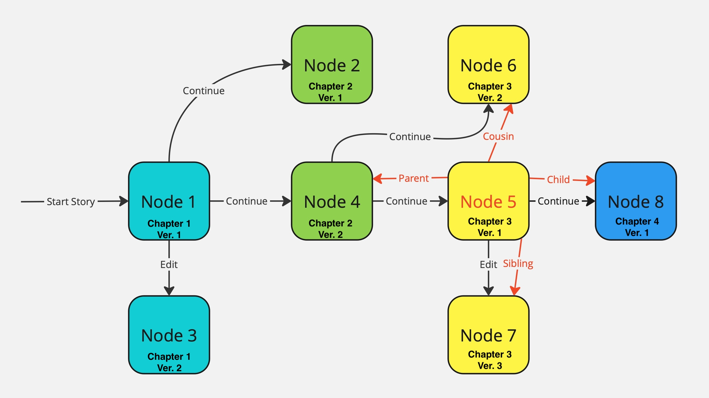
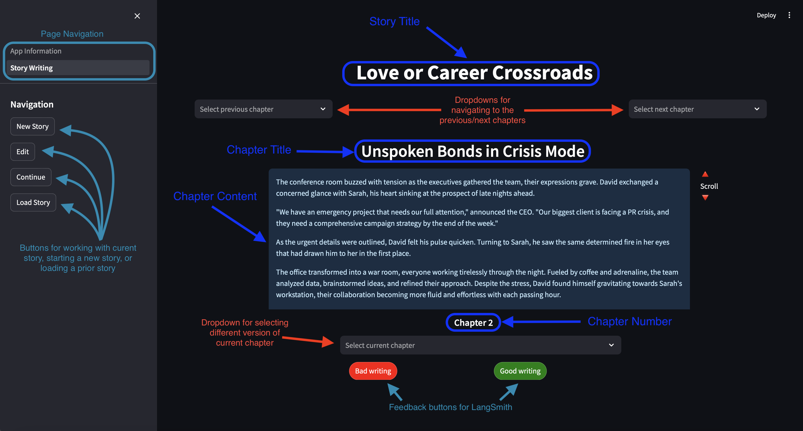
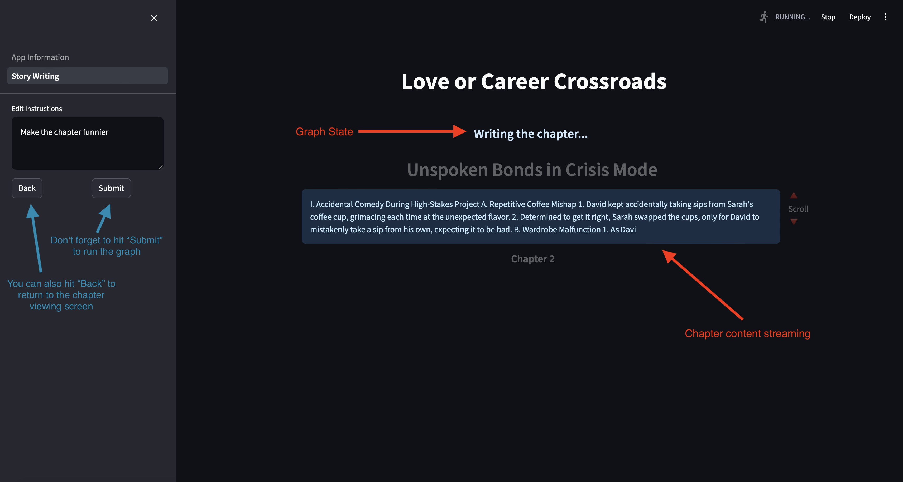

# App Information

This app is a quick example showing how you can use LangGraph Cloud in your applications. Before using the app, I highly recommend reading through this info guide to gain a better understanding of how it works.

## Running app locally

To run the app locally, clone the repository and then once you are in the repository directory call `streamlit run App_Information.py`. If you are hosting your own graph, make sure to change the url in the `get_client` function call in `pages/Story_Writing` to match the url of your deployed graph.

## Background

This app was designed to show off some LangGraph Cloud features in a fun, interactive way. This app is designed to allow users to write a story with the help of a LangGraph agent. The app allows users to edit chapters they have written already, or continue the story by writing the next chapter. This means the user can have multiple versions of the same chapter number and can select the one they like most to continue the story from. At the beginning the user provides the graph information on the summary of the story, the writing style they want, and any additional details important to the story. From that point they just need to provide edit and continue instructions to steer the agent in the desired direction.

*Note: This app is a prototype and not ready for deployment. There might be bugs/poor results from the agent.*

## The Graph State

One of the coolest features of LangGraph Cloud is the ability to have a persistent state across many runs of the graph. In this case we are able to retain information about the story as the graph continues to write it. In our case, we keep an overall chapter state graph, which is just a dictionary containing the different chapters written so far. Each time you edit or continue the story a new chapter is added to the graph. Each chapter keeps information about its content, title, and the relationship it has with the other chapters in the story (i.e. what chapters are siblings, children, parents, or cousins to it). Below is an example of what the chapter graph would look like after a user has been using the Story Writing tool for a little bit:

Let's dive into the graph to understand it a little better. First note that each color represents a different chapter number. In this instance we have two Chapter 1's, two Chapter 2's, three Chapter 3's, and a single Chapter 4. By following the node numbers we can reconstruct how this story was written. First, Node 1 was created when the user clicked on "New Story". Then Node 2 was created when the user pressed "Continue". The user then created Node 3 by editing the chapter that was contained in Node 1. You can follow the rest of the story creation on your own by tracking the increasing node numbers.

When using the story app, you can navigate between previous chapters, next chapters, current chapters. It can be a little hard to understand what chapters show up where, so let's take a look at an example where the user is currently viewing the chapter in Node 5. The following diagram highlights the relationships Node 5 has with other nodes, and the explanation below dives into how these relationships work and how they inform what previous, next, and current chapter options we have to choose from:

In this diagram, we draw red arrows representing all of the other nodes the user could move to.

- There is one "Next Chapter" option, Node 8, because Node 5 only has one child. If we were to press "Continue" again from Node 5 to create another child, there would then be two options for the "Next Chapter".
- There are three current chapter options. The first is Node 5 itself (the chapter you are viewing is always an option to be the current chapter!) and then Nodes 6 and 7 are also options. Node 7 is a "Sibling" of Node 5 because it was created by editing from Node 5. If we were to make further edits to Node 7, that new node would also be a sibling of Node 5. Any nodes that are direct "edit descendants" of a node are considered "Siblings" of that node.
- Node 6 is what we call a "Cousin" node because it originates from the same node as Node 5 (namely Node 4) but is not directly connected to it on our flow chart. Any nodes that originate from the same parent as a particular node are considered "Cousin" nodes. To summarize: the "Current Chapter" options consist of the current node itself, all of its "Sibling" nodes, and all of its "Cousin" nodes.
- Lastly, you can (unless you are at a node representing a Chapter 1 - in this case Node 1 and Node 3) go back to the previous chapter. Unlike the current or next chapter options, there is always only one previous chapter to go back to: your direct parent. For Node 5, its direct parent is Node 4, so that would show up as the option for the previous chapter.

One last important thing to note is that chapter options are displayed by their chapter title, which makes it slightly easier to know where you are going instead of relying on node numbers which don't have much significance to the user.

## Using the app

### While viewing a chapter

There are a variety of different things to navigate through while using the app, let's walk through them by exploring this screenshot:

At the top of the page you will see the title of the story, which is generated by the graph when the user starts the story. When you click on the "Load Story" button on the left-hand navigation pane, stories are listed by their titles to make it easier for users to remember which story they are loading.

Below the story title, there are two dropdowns for selecting the previous or next chapter to navigate to. These only show up as dropdowns if there exist chapters to move to, otherwise text saying "No next/previous chapters!" will show up.

Below those dropdowns, you can see the current chapter title. Chapter titles are generated by the graph after the chapter has been written to try and allow the title to match the chapter content as much as possible.

Below the chapter title is the actual chapter content itself. The chapter content is inside a scrollable element to limit the amount of vertical space it takes up.

Below the chapter content is the chapter number. Remember that the chapter number does not uniquely identify a chapter since we can create multiple "Chapter 2's", but this number serves to give us some reference of where we are in the story.

Next up we have the dropdown for selecting different versions of the current chapter (in this case the different "Chapter 2's").

Lastly, we have the feedback buttons, which are a cool feature that allows users to send feedback to LangSmith. When a user clicks on the "Bad Writing" or "Good Writing" button, feedback is automatically sent to the trace in LangSmith that corresponds to the run of the graph that wrote the chapter the user is currently viewing.

### While the graph is running

When the user navigates to the navigation panel and clicks "Submit" a graph run is started, and the app reacts accordingly. The most important thing to notice while the graph is running is that the graph state is streamed back to the user. Specifically you will see 5 messages in the Graph State location and they will appear in the following order:

- "Waiting for user input..." is when the user has yet to click submit, and the graph is waiting for the input
- "Summarizing story so far..." is written when the graph is summarizing the story up to this point. The graph does this so that it has better context on what to write next.
- "Brainstorming ideas for chapter.." occurs after the graph has summarized the story and is now thinking of ideas for the next chapter.
- "Planning outline for chapter..." comes after the brainstorm phase as the graph narrows down the ideas and creates a rough outline of the chapter.
- "Writing the chapter..." is the last step and is the only step where the LLM output is streamed to the user since this step is outputting the actual chapter content.

After the chapter is done being written, the app will automatically return to the "Chapter Viewing" state. You can also return to that state by clicking the "Back" button if you change your mind on making an edit or continuing the story.

## Ideas for future work

There are a ton of ways you could improve this app to make the:

- Improve the graph (smarter writing process, tool calling for writing style of famous authors)
- Add graph visualizations
- Add more functionality (user edits of the chapter)
